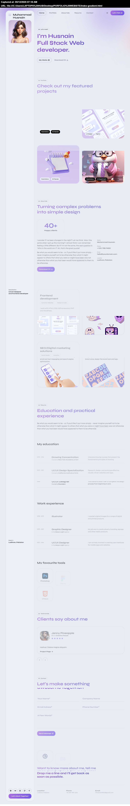

# 🚀 Modern Animated SPA Web Developer Portfolio

A sleek, single-page web developer portfolio designed to make a strong first impression. Built with modern front-end technologies, smooth animations, and a responsive layout, this SPA showcases your skills, projects, and contact information in an interactive and engaging way.

## 🧩 Features

- ⚡ **Single Page Application (SPA)** – Seamless navigation with no page reloads
- 🎨 **Modern UI/UX** – Clean design, bold typography, and color themes
- ✨ **Smooth Animations** – Scroll-triggered and hover effects powered by CSS/JS libraries
- 📱 **Responsive Design** – Fully optimized for mobile, tablet, and desktop
- 🧑‍💻 **Skills & Tech Stack** – Clearly presented core competencies and tools
- 🗂️ **Project Showcase** – Dynamic cards with live demo and GitHub links
- 📬 **Contact Form** – Fully functional form to receive inquiries directly

## 💻 Built With

- **HTML5 & CSS3 / SASS**
- **JavaScript (ES6+)**
- **GSAP / AOS** (for animations)
- **Vanilla JS Routing** or **React Router** *(optional for SPA behavior)*
- **FontAwesome / SVG Icons**
- **Responsive Grid/Flexbox Layouts**

